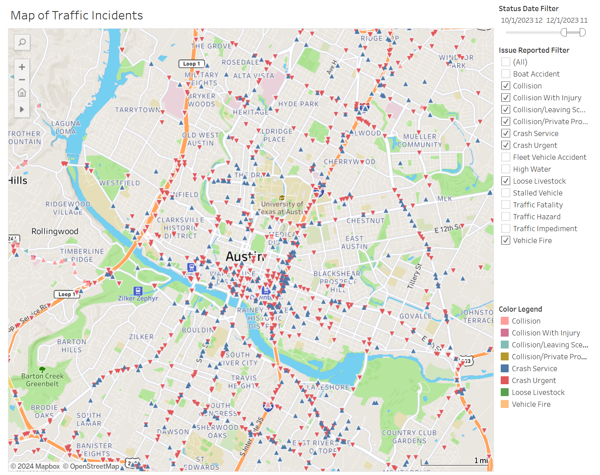
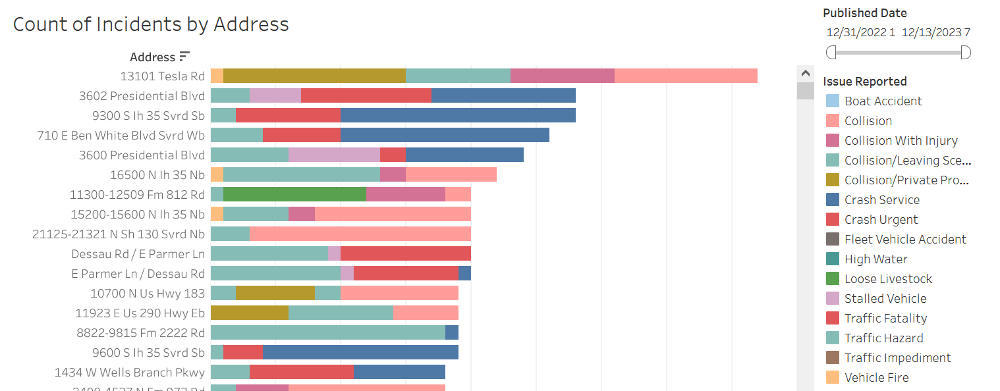
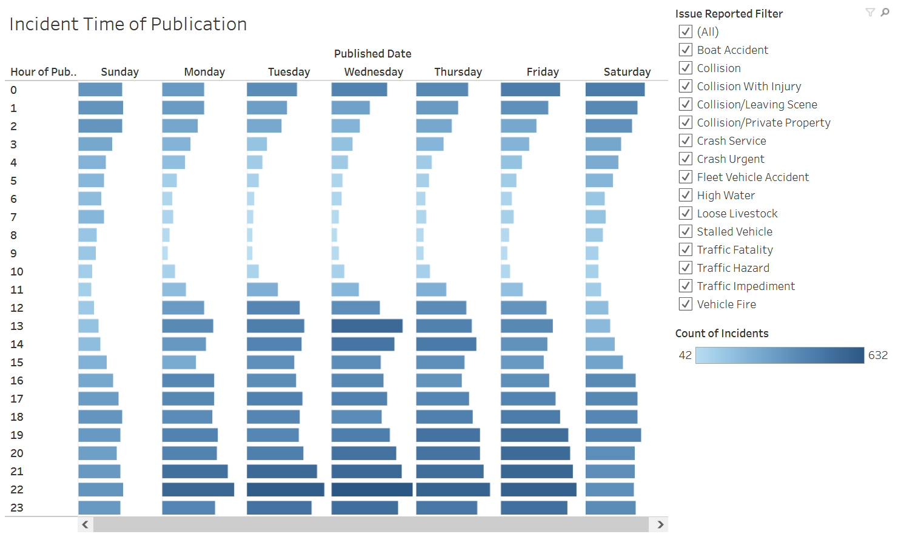

# austin-traffic

The purpose of this project is to analyze the City of Austin's public Traffic Incident data in order to identify patterns of frequent traffic issues that may impact quality of life for Austin residents.

Data is sourced from Austin Public Data - Real-Time Traffic Incident Reports

https://data.austintexas.gov/Transportation-and-Mobility/Real-Time-Traffic-Incident-Reports/dx9v-zd7x

### Exploratory Data Analysis

The initial exploratory data analysis is still underway, but the current results can be viewed at the following link.

[Link to interactive charts on Tableau Public](https://public.tableau.com/app/profile/arlenawu/viz/austintraffic/AustinTrafficIncidents2023?publish=yes)

So far, three charts have been published.

- Map of Traffic Incidents - Maps out the incidents recorded for 2023

	

- Count of Incidents by Address - Lists the number of incidents of each type that occurred at each reported address in 2023

	

- Incident Time of Publication - Shows a breakdown of when incidents were published by time of day and day of week.

	

### Incident Types

After checking with the dataset owner, it seems there is no official metadata to define all the entries. There are a few terms that have been outline, while the rest is currently inferred. Further research into the meaning of these terms will be needed.

#### Known Terms

- **Crash Service** - Collisions that are not blocking or impeding traffic. Collisions having occurred on private property. Leaving the scene collisions where there are no injuries, lanes, blocked, or any parties chasing the other as a result of the collision.

- **Crash Urgent** - Collisions involving minor injuries and or where minor injuries are suspected. Collisions that are blocking secondary roadways (non-high speed). Collisions having occurred on a HSR (High Speed Roadway), but are no longer blocking (having pulled to the shoulder / parking lot)*See Crash Service*. Collisions involving city vehicles. Traffic Hazard Any traffic hazard on major thoroughfares that may cause a collision, injuries, or otherwise cause undue traffic congestion. For example: pedestrians, stalled vehicles, debris in the roadway, and / or inoperative traffic signals.

- **Traffic Impediment** - Impediments located on minor roadways that do not pose an immediate hazardous situation; but if not addressed could cause future problems. For example: railroad arms stuck in the down position, stalled vehicles, and street parking issues that impede traffic.

#### Uncertain Terms

- **COLLISION, COLLISION WITH INJURY, COLLISION/PRIVATE PROPERTY, COLLISN/ LVNG SCN** - These terms appear to be self-explanatory, but it's uncertain what exactly differentiates them from Crash Urgent and Crash Service. Current hypothesis is that it may have to do with how the report is received, since the map (see Tableau link) shows these to be mainly on the fringes of the Austin area.

- **FLEET ACC/ FATAL** - Assumed - Fleet vehicle accident with fatalities ("fleet" indicates vehicles owned by an organization such as a company or government, rather than a private individual)

- **FLEET ACC/ INJURY** - Assumed - Fleet vehicle accident with injuries but no fatalities

- HIGH WATER - appears to be self-explanatory

- ICY ROADWAY - appears to be self-explanatory

- LOOSE LIVESTOCK - appears to be self-explanatory

- **Traffic Hazard, TRFC HAZD/ DEBRIS** - What differentiates these from Traffic Impediment?

- VEHICLE FIRE - appears to be self-explanatory

#### Unknown Terms

- COLLISN / FTSRA

- N / HZRD TRFC VIOL

